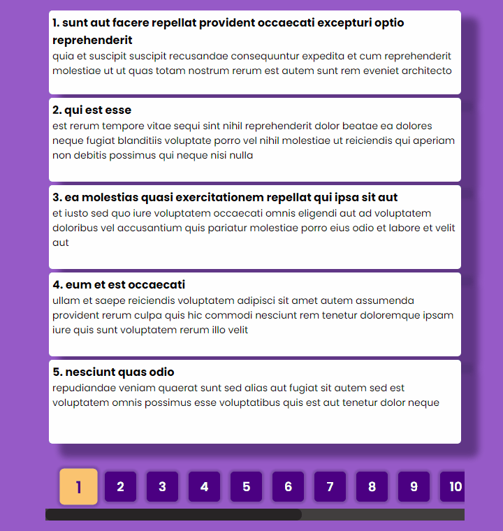

# Get Posts App (Paginations + API)

### About Project

***

Training project. Built to practice __**JavaScript**__. List of technologies used:

* ___HTML___
* ___CSS___
* ___JS___

_*In this project, we get some number of posts from the server. Then we process them and display 5 posts per page. Regarding the number of posts, we add pagination with page numbers. By these numbers, the following posts are available to us for display on the screen in order.*_

***

__My contacts:__
[Telegram](https://t.me/eurokot)
[Instagram](https://www.instagram.com/sadpage.js/)
<a href='mailto:eurokot_dev@mail.ru'>Email</a>

__[Up](#anchor)__